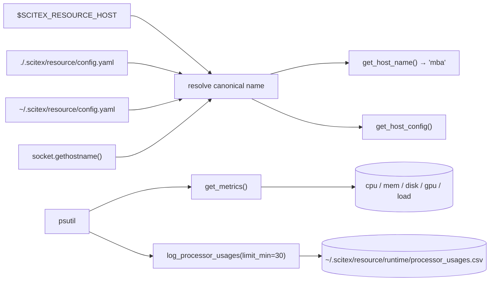

# scitex-resource

<p align="center">
  <a href="https://scitex.ai">
    
  </a>
</p>

<p align="center"><b>System resource info, processor usage logging, RAM limiting + host-identity config.</b></p>

<p align="center">
  <a href="https://scitex-resource.readthedocs.io/">Full Documentation</a> · <code>uv pip install scitex-resource[all]</code>
</p>

<!-- scitex-badges:start -->
<p align="center">
  <a href="https://pypi.org/project/scitex-resource/"></a>
  <a href="https://pypi.org/project/scitex-resource/"></a>
  <a href="https://github.com/ywatanabe1989/scitex-resource/actions/workflows/test.yml"></a>
  <a href="https://codecov.io/gh/ywatanabe1989/scitex-resource"></a>
  <a href="https://scitex-resource.readthedocs.io/en/latest/"></a>
  <a href="https://www.gnu.org/licenses/agpl-3.0"></a>
</p>
<!-- scitex-badges:end -->

---

## Installation

```bash
pip install scitex-resource
```

## Architecture

```
src/scitex_resource/
├── __init__.py                # public API surface (lazy via __getattr__)
├── _host.py                   # canonical host name + host config resolution
├── _machine.py                # deprecated aliases → _host (back-compat)
├── _runtime.py                # SCITEX_DIR-aware runtime path resolver
├── _log_processor_usages.py   # CPU / RAM / GPU / VRAM CSV logger
├── limit_ram.py               # cap process RSS via resource.RLIMIT_AS
├── _compat.py                 # vendored str / gen helpers (decoupling)
├── _cli/                      # Click-based CLI (hosts, specs, metrics, …)
├── _mcp/                      # FastMCP server (Python-API mirror)
├── _utils/                    # psutil wrappers (metrics / specs)
└── _specs/                    # rich human-readable snapshot helpers
```

## 1 Interfaces

<details open>
<summary><strong>Python API</strong></summary>

<br>

```python
import scitex_resource as r

# Hub-friendly metrics (cross-platform via psutil)
metrics = r.get_metrics()

# Canonical host identity
name = r.get_host_name()
cfg = r.get_host_config()        # {"canonical_name", "aliases", "role", "hpc": {...}}

# Rich snapshot
specs = r.get_specs()

# CPU/RAM/GPU/VRAM samples + continuous CSV logging
usage = r.get_processor_usages()
r.log_processor_usages(limit_min=30, interval_s=1)
# default: ~/.scitex/resource/runtime/processor_usages.csv

# Cap process RAM
r.limit_ram(0.5)
```

</details>

<details>
<summary><strong>CLI</strong></summary>

<br>

```bash
# Host identity
$ scitex-resource hosts show
$ scitex-resource hosts config show --json

# System specs and live metrics
$ scitex-resource specs
$ scitex-resource metrics show --json

# Processor usage snapshot + continuous CSV log
$ scitex-resource processor-usages show --json
$ scitex-resource processor-usages log --interval 5 --max-rows 12

# Cap process RAM
$ scitex-resource ram-limit 0.8
```

</details>

## Demo



## Quick Start

```python
import scitex_resource as r

print(r.get_host_name())           # canonical host identity
metrics = r.get_metrics()          # cpu / mem / disk / gpu / load
specs = r.get_specs()              # rich human-readable snapshot
```

## Host identity config — `~/.scitex/resource/config.yaml`

```yaml
host:
  canonical_name: mba                 # what every scitex-* package uses to refer to this host
  aliases:                            # optional; cross-package discovery / drift detection
    - Yusukes-MacBook-Air
    - Yusukes-MacBook-Air.local
  role: head                          # generic role tag (head, worker, hpc-login, ...)
  hpc:                                # optional; HPC-only
    cluster: spartan
    login_only: true
    partitions: [physical, sapphire]
```

Resolution cascade (highest precedence first):

1. `$SCITEX_RESOURCE_HOST`
2. `<project>/.scitex/resource/config.yaml` `host.canonical_name`
3. `~/.scitex/resource/config.yaml` `host.canonical_name`
4. `socket.gethostname().split(".", 1)[0]`

(Deprecated `$SCITEX_RESOURCE_MACHINE` and `machine:` config block are
still honoured as fallbacks with a one-time ``DeprecationWarning``.)

## Status

Standalone fork of `scitex.resource`. Deps: pandas, psutil, PyYAML, click.

Decoupling notes:
- `scitex.str.readable_bytes` / `scitex.gen.fmt_size` / `scitex.str.printc` →
  vendored as small helpers in `_compat.py`.
- `scitex.io._load.load` / `scitex.io._save.save` → use `pandas.read_csv` /
  `to_csv` directly for the CSV log files.
- `scitex.sh.sh` → prefer `scitex_sh` if installed, fall back to plain
  `subprocess.run` (list-only).

The umbrella package's `scitex.resource` import path is preserved via a
`sys.modules`-alias bridge.

## Part of SciTeX

`scitex-resource` is part of [**SciTeX**](https://scitex.ai). Install via
the umbrella with `pip install scitex[resource]` to use as
`scitex.resource` (Python) or `scitex resource ...` (CLI).

>Four Freedoms for Research
>
>0. The freedom to **run** your research anywhere — your machine, your terms.
>1. The freedom to **study** how every step works — from raw data to final manuscript.
>2. The freedom to **redistribute** your workflows, not just your papers.
>3. The freedom to **modify** any module and share improvements with the community.
>
>AGPL-3.0 — because we believe research infrastructure deserves the same freedoms as the software it runs on.

## License

AGPL-3.0-only (see [LICENSE](./LICENSE)).

---

<p align="center">
  <a href="https://scitex.ai" target="_blank"></a>
</p>
